# Entrega — Cartografía y Estrategia de Modernización

- **Aplicación a modernizar:** Newspipe — lector/agregador de RSS-Atom multiusuario (licencia AGPL-3.0-or-later)
- **Stack legado:** Python ≥ 3.10 · Flask 3.1 (WSGI, síncrono) · SQLAlchemy 2.0 · PostgreSQL · ~9 400 LOC (4 715 Python + 2 434 Jinja2, medidas con `pygount`)
- **Repositorio del equipo:** https://github.com/ModernizacionGrupo9/newspipe (fork del proyecto `cedricbonhomme/newspipe`)
- **Herramienta de cartografía:** CodeScene Community Edition
- **Equipo:** Grupo 9 — Andrés Donoso, Daniel Corzo, Germán Martínez, Jonatan Hernández
- **Fecha:** 2026-06-23

> Este documento consolida las dos actividades de la semana 4: (1) *Definir y aplicar estrategia de cartografía* y (2) *Decidir la estrategia de modernización y el alcance*. Las visualizaciones y métricas de mantenibilidad provienen del análisis real ejecutado en CodeScene sobre el repositorio de Newspipe; los diagramas de arquitectura concreta as-is se derivaron de la inspección directa del código fuente.
>
> **Relación con la Entrega 1:** en la Entrega 1 se presentó la **arquitectura de referencia** de la tecnología legada (el modelo genérico WSGI/Flask: ciclo de vida de la petición y organización por capas). En cumplimiento de la guía de la semana 4, aquí se presentan los diagramas de la **arquitectura de software concreta de Newspipe** (sección 1.3), no ya el modelo de referencia.

---

# Parte 1 — Cartografía

## 1.1 Justificación de la elección de la herramienta de cartografía

Se eligió **CodeScene Community Edition** como herramienta de cartografía. La justificación es la siguiente:

- **Cubre los dos ejes exigidos en una sola herramienta.** CodeScene responde tanto preguntas de **mantenibilidad** (Code Health, Hotspots, change coupling, complejidad) como de **arquitectura** (definición de componentes por patrones de ruta y métricas agregadas por componente con su tendencia temporal).
- **Análisis "behavioral", no solo estático.** A diferencia de un linter o de SonarQube clásico, CodeScene combina el análisis del código con el **historial de commits** (Git). Esto permite responder preguntas que un análisis puramente estático no puede: qué archivos cambian con más frecuencia (Hotspots), qué archivos cambian juntos (change coupling) y, sobre todo, **dónde está el conocimiento y el riesgo de fuga** (Author Statistics, bus factor). Para una aplicación legada mantenida durante más de 12 años por pocas personas, esta dimensión social del código es decisiva.
- **Mide degradación en el tiempo.** La vista *System Health* muestra la **tendencia** del Code Health por componente, lo que permite distinguir un componente que está mal pero estable de uno que se está **deteriorando**.
- **Restricciones satisfechas.** Newspipe es un repositorio open source, público y con historial de commits completo, condiciones que exige la edición Community. Python está entre los lenguajes soportados.
- **Continuidad con el trabajo del curso.** Es la herramienta trabajada en el tutorial (OpenCMS) y en el reto individual, por lo que el equipo domina las visualizaciones y configuraciones, reduciendo el riesgo de mala interpretación de las métricas.

Para el **eje de arquitectura** (componentes funcionales, despliegue, fuentes de datos y patrones) se complementó CodeScene con **inspección directa del código fuente** y la documentación del repositorio, de donde se derivaron los diagramas de arquitectura concreta presentados en la sección 1.3.

## 1.2 Preguntas que se desean responder

### Eje de arquitectura

| ID | Pregunta |
|----|----------|
| **A1** | ¿Cuáles son los componentes funcionales de la aplicación y cómo se relacionan? |
| **A2** | ¿Cómo es el despliegue de los componentes? |
| **A3** | ¿Cómo se relacionan los componentes con las fuentes de datos? |
| **A4** | ¿Qué patrones y tácticas de arquitectura se usan? |

### Eje de mantenibilidad

| ID | Pregunta |
|----|----------|
| **M1** | ¿Cuáles son los archivos con más problemas de mantenibilidad? ¿Por qué? |
| **M2** | ¿Cuál es el componente de arquitectura con más problemas de mantenibilidad y cuál se está degradando? ¿Por qué? |
| **M3** | ¿Existen riesgos de fuga y pérdida de conocimiento (bus factor)? ¿En qué partes y por qué? |
| **M4** | ¿Existen archivos fuertemente acoplados (change coupling) o código duplicado/muerto? |

## 1.3 Respuestas — Eje de arquitectura

### A1. Componentes funcionales y sus relaciones

Newspipe implementa una **arquitectura en capas** (presentación → lógica de negocio → persistencia) con un componente de **crawler asíncrono** que se ejecuta por fuera del ciclo de petición web. Los componentes funcionales identificados a partir del código son:

| Componente | Ubicación en el código | Responsabilidad |
|---|---|---|
| **Web — UI (Presentación)** | `newspipe/web/views/*` + `templates/` (Jinja2) + `forms.py` | 11 *blueprints* Flask (`feeds`, `articles`, `categories`, `bookmarks`, `admin`, `user`, `stats`, …) que atienden las peticiones HTTP del navegador y renderizan HTML. |
| **Web — API v2 (Presentación)** | `newspipe/web/views/api/v2/*` | API REST (`/api/v2.0`) sobre Flask-RESTful, con autenticación HTTP Basic, para feeds, artículos y categorías. |
| **Controllers (Lógica de negocio)** | `newspipe/controllers/*` | Capa de negocio basada en un `AbstractController` genérico (CRUD + filtrado + control de acceso por `user_id`). Controladores especializados: `FeedController`, `ArticleController`, `UserController`, `CategoryController`, `BookmarkController`. |
| **Models (Persistencia)** | `newspipe/models/*` | Entidades SQLAlchemy del dominio: `User`, `Feed`, `Article`, `Category`, `Bookmark`, `Icon`, `ArticleTag`, `BookmarkTag`, además de `Role` y `right_mixin` (gestión de permisos por rol vía Flask-Principal). |
| **Crawler (Trabajo en segundo plano)** | `newspipe/crawler/default_crawler.py` | Descarga y parseo asíncrono de feeds RSS/Atom (`asyncio` + `aiohttp` + `feedparser`), patrón productor/consumidor con `asyncio.Queue`. |
| **Notifications** | `newspipe/notifications/*` | Envío de notificaciones por correo. |
| **Commands (CLI / administración)** | `newspipe/commands.py` | Comandos de administración vía Click: crear admin, limpiar usuarios/artículos, lanzar el crawler (`fetch_asyncio`), buscar vulnerabilidades, etc. |
| **Bootstrap / Lib (Soporte)** | `newspipe/bootstrap.py`, `newspipe/lib/*` | *Application factory* de Flask, configuración, base de datos, migraciones (Alembic), i18n (Babel), seguridad (CSRF, CSP) y utilidades. |

**Relaciones entre componentes (flujo de control):**

- **Web UI** y **API v2** → invocan **Controllers** (instanciándolos con `current_user.id` para el control de acceso).
- **Controllers** → acceden a **Models** mediante el ORM de SQLAlchemy.
- **Crawler** y **Commands** → reutilizan los **Controllers** (`ArticleController`, `FeedController`) para insertar/actualizar artículos y metadatos de feeds.
- **Models** → mapean a la base de datos relacional.

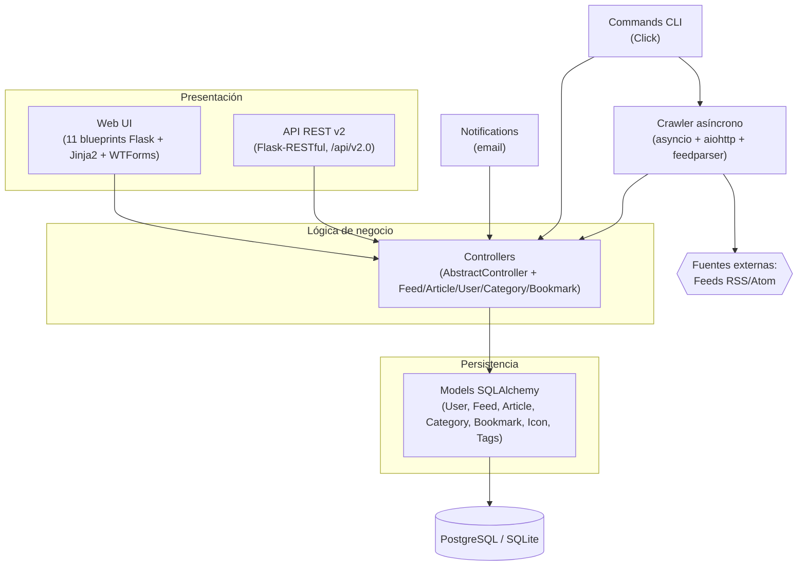
*Figura A1. Diagrama de componentes concreto (as-is) de Newspipe y sus relaciones.*

### A2. Despliegue de los componentes

Newspipe es una aplicación **WSGI (síncrona)**. Su despliegue concreto se compone de dos procesos independientes que comparten la misma base de datos:

1. **Proceso web (online):** la aplicación Flask (`app:application`) servida por un **servidor WSGI** (Gunicorn en producción; el servidor de desarrollo de Flask con `app.run()` en local), escuchando por defecto en el puerto **5000**. Atiende tanto la UI web como la API v2. Soporta despliegue tras un *reverse proxy* (middleware `ReverseProxied` en `bootstrap.py`).
2. **Proceso crawler (offline / batch):** el comando `flask fetch_asyncio`, lanzado periódicamente (típicamente vía **cron** o de forma manual), que recorre los feeds habilitados y persiste los artículos nuevos. **No** corre dentro del proceso web: es una tarea batch separada.

Ambos procesos persisten contra la misma **base de datos relacional** (PostgreSQL en producción, SQLite como alternativa), gestionada con migraciones **Alembic**.

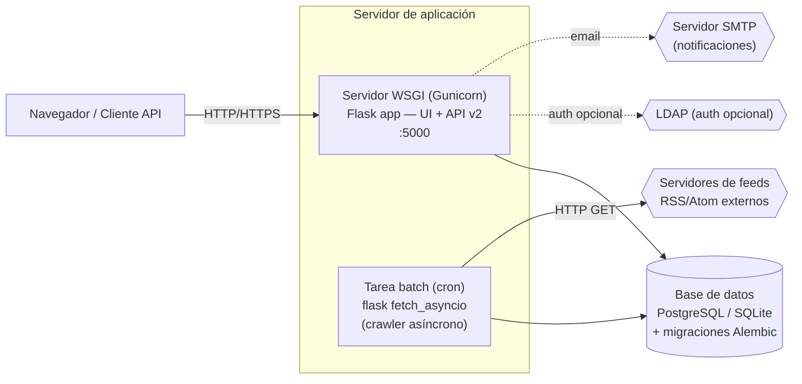
*Figura A2. Diagrama de despliegue concreto (as-is). El crawler es un proceso batch independiente del proceso web; ambos comparten la base de datos.*

> **Nota sobre la naturaleza WSGI:** que el crawler I/O-bound se haya tenido que sacar a un proceso `asyncio` separado, en lugar de integrarlo al servidor web, es una **consecuencia directa del modelo WSGI síncrono** de Flask. Este punto es relevante para la estrategia de modernización (Parte 2).

### A3. Relación de los componentes con las fuentes de datos

Newspipe maneja **una fuente de datos interna** (la base de datos relacional) y **varias fuentes externas**:

- **Base de datos relacional (interna).** Acceso exclusivo a través de la capa **Models (SQLAlchemy)**; ninguna capa superior consulta la BD directamente. La sesión y la configuración se cablean en `bootstrap.py` (`SQLAlchemy(application)` + `Migrate`). El modelo de datos del dominio:

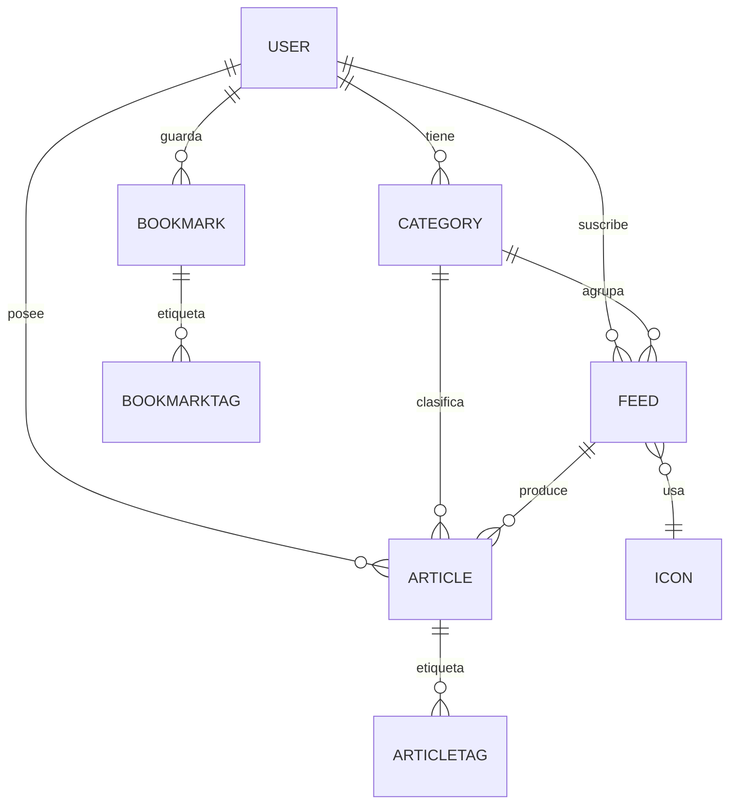
*Figura A3. Modelo de datos concreto (entidades SQLAlchemy y relaciones).*

- **Fuentes externas:**
  - **Feeds RSS/Atom:** consumidos por el **Crawler** vía HTTP GET (`aiohttp`/`requests`), parseados con `feedparser`. Se cachean con cabeceras `etag`/`last-modified` almacenadas en el modelo `Feed`.
  - **LDAP (opcional):** autenticación de usuarios corporativa vía `ldap3`, invocada desde los formularios de login.
  - **Servicio de vulnerabilidades (CIRCL):** consultado por el comando `find_vulnerabilities`.
  - **SMTP:** para el envío de notificaciones por correo.

### A4. Patrones y tácticas de arquitectura

| Patrón / Táctica | Cómo se concreta en Newspipe |
|---|---|
| **Arquitectura en capas** | Presentación (`web/`) → Negocio (`controllers/`) → Persistencia (`models/`). |
| **Application Factory** | `bootstrap.py` construye la app Flask, carga configuración y registra extensiones. |
| **Flask Blueprints** | 11 blueprints que modularizan el ruteo de la UI. |
| **Patrón "AbstractController"** | Clase base genérica con CRUD y un *DSL* de filtros (`__gt`, `__lt`, `__in`, `__like`, `__ilike`, `__ne`, `__contains`); los controladores concretos heredan de ella. |
| **ORM (SQLAlchemy 2.0)** | Mapeo declarativo de entidades, relaciones con reglas de cascada, validadores `@validates`. |
| **MVC-ish** | Vistas (rutas Flask + plantillas Jinja2), Controllers (negocio), Models (ORM). |
| **Recurso REST genérico** | `PyAggAbstractResource` como plantilla de recursos REST para feeds/artículos/categorías (API v2). |
| **Autenticación / autorización** | Sesión por cookie con **Flask-Login**; permisos por rol con **Flask-Principal** (`Role`, `right_mixin`); autenticación opcional vía **LDAP**. |
| **Seguridad (tácticas)** | CSRF (`CSRFProtect`), CSP (`flask-talisman`), saneamiento de HTML (`bleach`), hashing de contraseñas (`werkzeug`), **consultas con alcance por `user_id`** (seguridad a nivel de fila). |
| **Internacionalización** | Babel (`lazy_gettext`), selección de locale y zona horaria por usuario. |
| **Crawler asíncrono (productor/consumidor)** | `asyncio` + `aiohttp` + `asyncio.Queue` con semáforo (máx. 10 peticiones concurrentes). |
| **Modelo WSGI síncrono** | El procesamiento de peticiones web es síncrono; la concurrencia I/O-bound solo existe en el crawler, fuera del servidor web. |

## 1.4 Respuestas — Eje de mantenibilidad

> Salud global del sistema en CodeScene: **9.27 / 10 (Healthy)**, 88 archivos analizados. El sistema no es "insano", pero los problemas se concentran en un grupo reducido de archivos y en un componente con tendencia a la baja, como se detalla a continuación.

### M1. Archivos con más problemas de mantenibilidad

**Visualización usada:** *Code Health* (enclosure diagram) y pestaña *Hotspots*.

Los problemas se concentran en un grupo de archivos marcados como **Problematic** (amarillo), casi todos en el componente `web`:

| Archivo | Ruta | Code Health | LoC | Commits/año | Autor principal |
|---|---|---|---|---|---|
| `common.py` | `newspipe/web/views/api/v2/` | **7.71** (Problematic) | 208 | 1 | François Schmidts (60%) |
| `forms.py` | `newspipe/web/` | 8.78 (Problematic) | 297 | 4 | Cédric Bonhomme (82%) |
| `feed.py` | `newspipe/web/views/` | 8.79 (Problematic) | 333 | 4 | Cédric Bonhomme (60%) |
| `commands.py` | `newspipe/` | 8.95 (Problematic) | 235 | 2 | Cédric Bonhomme (99%) |

**¿Por qué son los más problemáticos?**

- **`common.py` (7.71)** es el archivo con **menor Code Health** del sistema. Es la base genérica de recursos REST de la API v2 (`PyAggAbstractResource`): apila decoradores de autenticación/serialización en todos los métodos HTTP y concentra un parseo de argumentos con filtrado de atributos según el rol (admin / usuario API / usuario base), además de operaciones masivas con semántica de fallo parcial. Esa generalidad lo vuelve denso y difícil de evolucionar pese a tener poca actividad (1 commit/año).
- **`feed.py` (8.79)** es el caso prioritario: es el archivo problemático **más grande (333 LoC)** y en la vista **Hotspots aparece en rojo intenso** (alta frecuencia de cambio). Mezcla responsabilidades (CRUD de feeds, estadísticas de artículos, gestión de filtros dinámicos, validación de URL/SSRF, paginación, bookmarklet). El cruce de código poco saludable con alta tasa de cambio es el patrón de mayor riesgo según CodeScene.
- **`forms.py` (8.78)** concentra múltiples formularios WTForms con validación custom (unicidad de nickname, fallback a LDAP, aprovisionamiento de usuarios).
- **`commands.py` (8.95)** agrupa comandos administrativos heterogéneos (limpieza de datos, regex de vulnerabilidades, orquestación del crawler asíncrono).

**Contraste con los Hotspots "sanos":** los archivos más activos (`bookmark.py`, 9.68 y 7 commits/año; `default_crawler.py`, 9.16 y 4 commits/año) mantienen Code Health alto: cambian mucho pero están bien estructurados, por lo que **no** representan riesgo de mantenibilidad.

**Evidencias:**

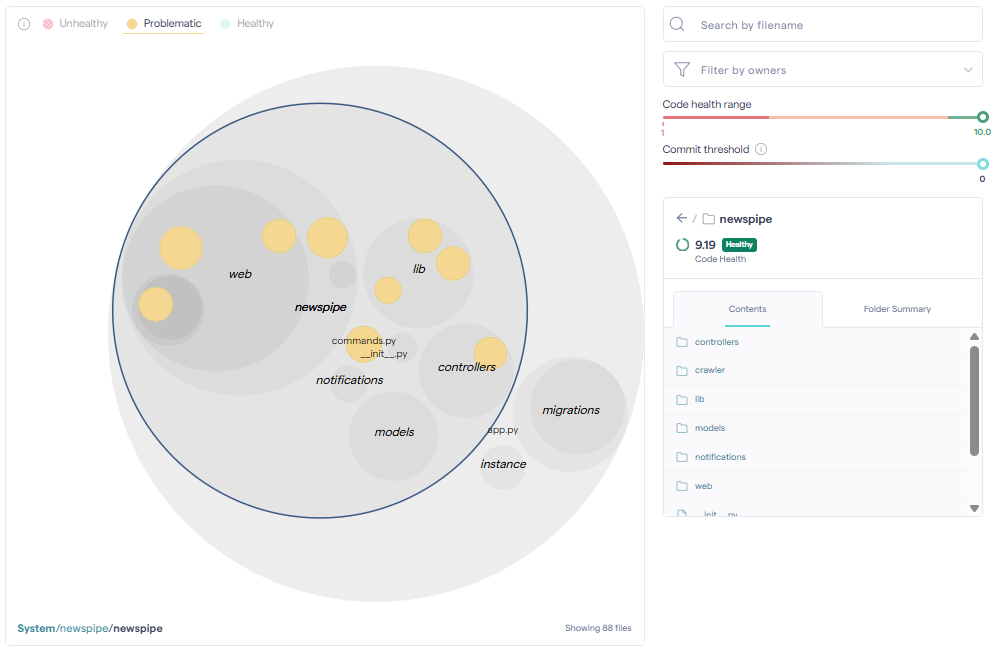
*Figura M1a. Mapa de Code Health. Los círculos amarillos son los archivos Problematic, concentrados en `web`.*

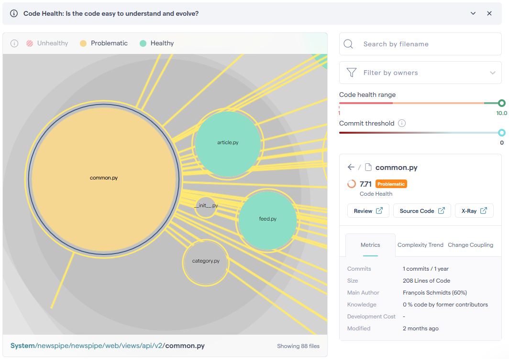 · 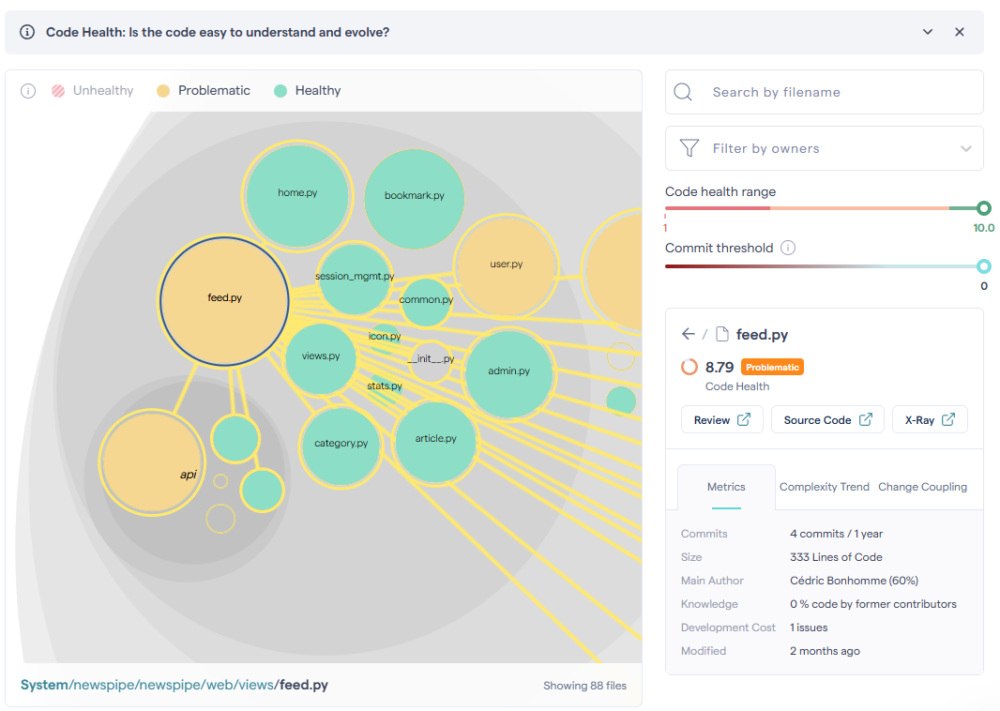 · 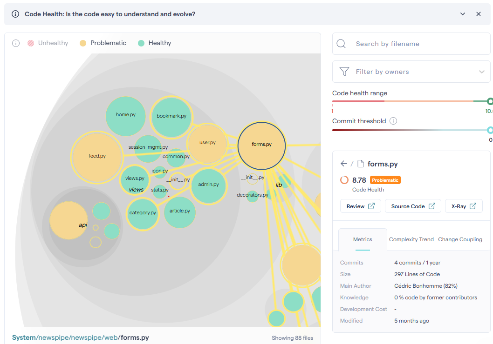 · 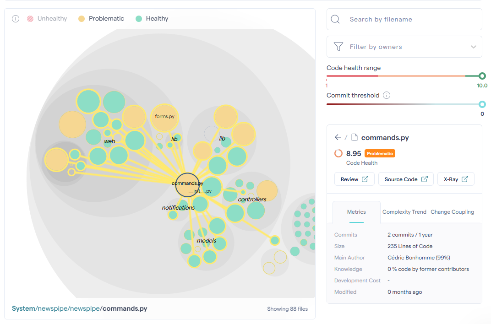
*Figura M1b. Detalle de Code Health de los cuatro archivos Problematic: `common.py` (7.71), `feed.py` (8.79), `forms.py` (8.78) y `commands.py` (8.95).*

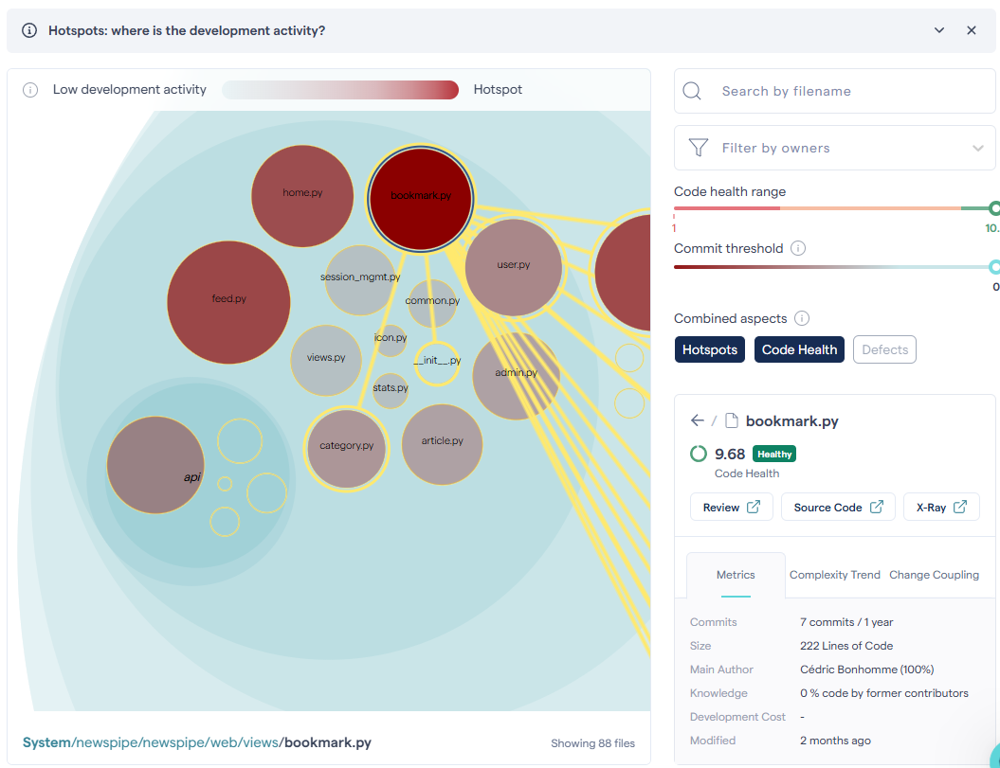 · 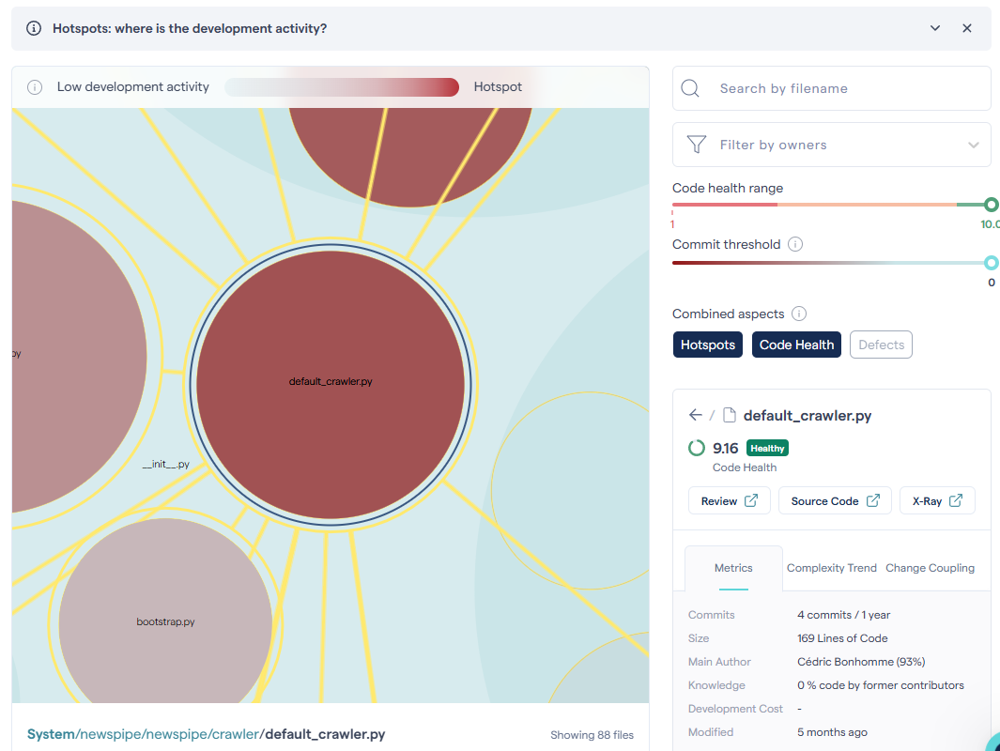
*Figura M1c. Hotspots: `bookmark.py` (9.68) y `default_crawler.py` (9.16) son muy activos pero sanos.*

### M2. Componente con más problemas y componente que se degrada

**Visualización usada:** *Architecture → System Health*. Se definieron en CodeScene 3 componentes que reflejan la arquitectura por capas:

| Componente | Patrones de ruta | Rol |
|---|---|---|
| **Web (Presentación)** | `newspipe/newspipe/web/**` | Vistas Flask, formularios y API v2 |
| **Backend (Núcleo)** | `newspipe/newspipe/{controllers,crawler,notifications,lib}/**` | Negocio, crawling, notificaciones, utilidades |
| **Datos (Persistencia)** | `newspipe/newspipe/models/**` | Entidades SQLAlchemy |

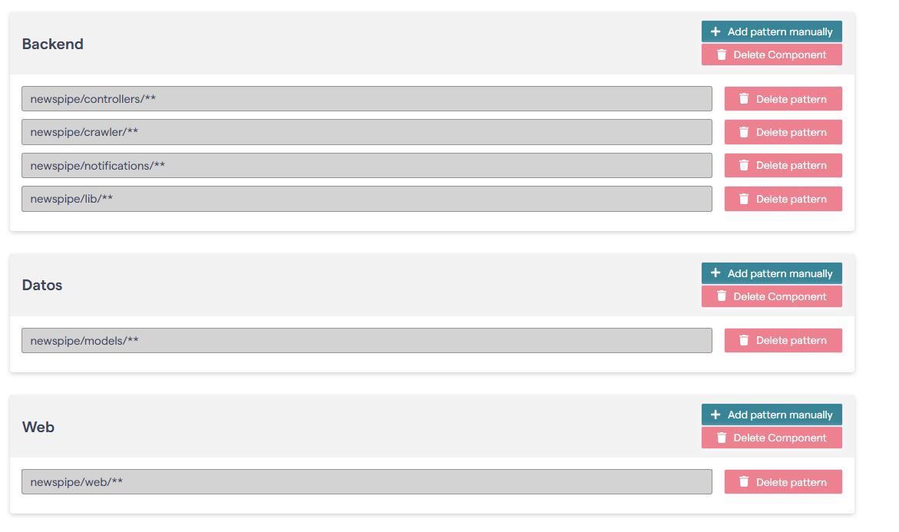
*Figura M2a. Definición de los componentes Web, Backend y Datos por patrones de ruta en el Architectural Component Editor de CodeScene.*

| Componente | Commits | Code Health (prom. pond.) | Worst | Hotspots Health | Tendencia |
|---|---|---|---|---|---|
| **Web** | 18 | 9.25 | 7.72 | 9.07 | Estable (9.18→9.07) |
| **Backend** | 15 | **8.96** | **7.47** | **8.48** | **Descendente (8.56→8.48)** |
| Datos | 4 | 9.96 | 9.69 | 10.0 | Estable (perfecta) |
| No Component | 7 | 9.63 | 8.96 | 9.17 | Estable |

**El componente con más problemas es `Backend`:** es el de menor Code Health ponderado (8.96) y, sobre todo, **el único con tendencia descendente** (8.56→8.48). Su *Hotspots Code Health* (8.48) es el más bajo del sistema: el código que más se modifica dentro de Backend es también el menos saludable. Agrupa responsabilidades heterogéneas (negocio, crawling, notificaciones, utilidades), lo que explica la acumulación difusa de deuda.

**Matiz Web vs. Backend:** `Web` es el más activo (18 commits) y aloja el **peor archivo individual** (worst 7.72 = `common.py`/`feed.py`), pero su salud global se mantiene estable. En Web el riesgo está **localizado en archivos puntuales**; en Backend el problema es del **componente como conjunto**, y además **empeora con el tiempo**. `Datos` es ejemplar (9.96, tendencia plana).

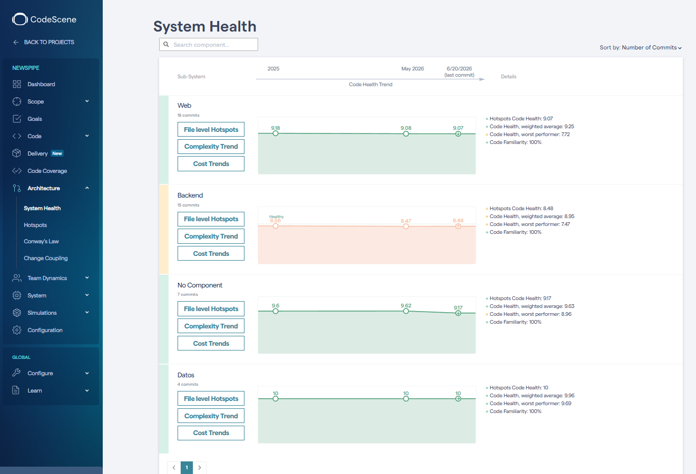
*Figura M2b. System Health por componente: Backend (8.96) es el único con tendencia descendente; Web y Datos se mantienen estables.*

### M3. Riesgos de fuga y pérdida de conocimiento

**Sí existen.** **Visualización usada:** *Team Dynamics → Author Statistics*.

| Autor | Archivos que posee | Commits | Última contribución | LOC neto |
|---|---|---|---|---|
| **Cédric Bonhomme** | **72 de 88** | 942 | 2026-06-20 (activo) | 5 066 |
| **François Schmidts** | 14 | 123 | **2016-02-02** (~10 años inactivo) | 1 609 |
| B. Stack | 2 | 3 | 2023-09-16 | 306 |
| Edward Betts | 0 | 1 | 2018-03-31 | 0 |
| luzpaz | 0 | 1 | 2024-02-28 | 0 |

**1. Bus factor extremo (Cédric Bonhomme).** Es *Primary File Owner* de **72 de 88 archivos (~82%)** y concentra **942 commits**. Prácticamente todo el conocimiento depende de una sola persona. Se confirma a nivel de archivo: figura como autor del 60–100 % de los archivos problemáticos y hotspots (`commands.py` 99 %, `bookmark.py` 100 %, `default_crawler.py` 93 %, `forms.py` 82 %).

**2. Conocimiento huérfano ya materializado (François Schmidts).** Posee **14 archivos** pero su **última contribución fue en febrero de 2016**. El punto crítico es la **convergencia con M1**: el archivo de **peor Code Health, `common.py` (7.71)**, es propiedad de François (60 %). El código más difícil de mantener es además el que tiene a su dueño fuera del proyecto → **máximo riesgo de fuga de conocimiento**, justo en la **API v2**.

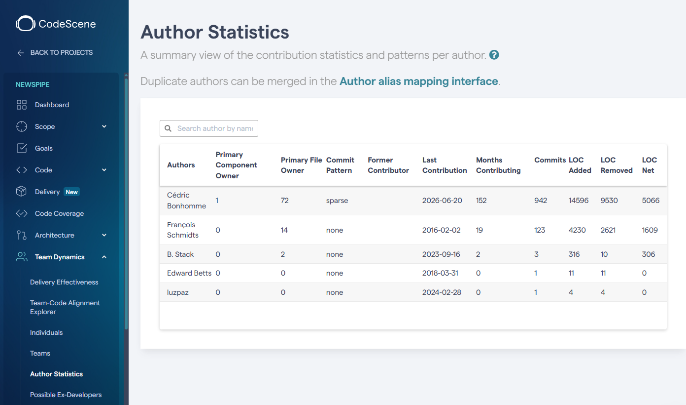
*Figura M3. Author Statistics: Cédric posee 72/88 archivos (bus factor); François posee 14 archivos pero inactivo desde 2016 (conocimiento huérfano, incluido `common.py`).*

### M4. Acoplamiento, código duplicado o muerto

CodeScene representa el **change coupling** (archivos que tienden a cambiar juntos) mediante las **líneas amarillas** del mapa de Code Health. El acoplamiento observado es coherente con la arquitectura en capas: las vistas de un dominio cambian junto con su controlador/modelo (p. ej. `feed.py` ↔ controlador/modelo de feeds). No se identificaron, con la edición Community, focos graves de **código muerto**; el riesgo de mantenibilidad dominante no es la duplicación sino la **concentración de complejidad** en pocos archivos (M1) y la **degradación del componente Backend** (M2).

## 1.5 ¿Existen atributos de calidad degradados?

**Sí. El atributo de calidad degradado es la MANTENIBILIDAD.** Lo sustentamos con las siguientes métricas concretas de CodeScene:

1. **Degradación temporal medible del componente Backend:** su Code Health cae de **8.56 a 8.48** y es el **único componente con tendencia descendente** del sistema (Figura M2b). Es una degradación *en curso*, no estática.
2. **Concentración de deuda en archivos clave:** `common.py` baja a **7.71** (el peor del sistema) y `feed.py` (8.79) es un hotspot problemático de alta frecuencia de cambio (Figuras M1a y M1b).
3. **Degradación de la mantenibilidad por factor social:** el bus factor (Cédric, 72/88 archivos) y el conocimiento huérfano (François, dueño de `common.py`, inactivo desde 2016) degradan la capacidad real del equipo para evolucionar el sistema con seguridad (Figura M3).

Afirmamos degradación **solo de mantenibilidad**, porque es el único atributo del que tenemos **evidencia objetiva** (CodeScene). **No** afirmamos degradación de desempeño ni de usabilidad: no se realizaron pruebas de carga ni encuestas de usuario sobre Newspipe, por lo que sostener esas degradaciones no tendría respaldo.

---

# Parte 2 — Estrategia de modernización y alcance

## 2.1 Motivador de negocio

> **Motivador de negocio:** *Sostener la velocidad de evolución del producto y reducir el riesgo operativo asociado a la dependencia de una sola persona*, de modo que el equipo pueda seguir incorporando funcionalidades (especialmente sobre la API) sin que el costo de cambio y el riesgo de error sigan creciendo.

Este motivador se relaciona directamente con el **atributo de calidad degradado y priorizado en la actividad 1: la mantenibilidad**, evidenciada por:
- el deterioro progresivo del componente **Backend** (8.56→8.48),
- la concentración de complejidad en `common.py` (API v2) y `feed.py`, y
- el **bus factor** y el **conocimiento huérfano** en la API v2.

La priorización de la mantenibilidad es deliberada: es el atributo con evidencia objetiva y el que más limita hoy la capacidad del negocio de entregar valor nuevo de forma rápida y segura.

**Continuidad con la Entrega 1.** Este motivador no es nuevo: aterriza, con evidencia de cartografía, dos de los cuatro problemas que el equipo ya había planteado como motivación en la Entrega 1 — *"sin tipos ni contratos formales de API"* y *"difícil de evolucionar"*. CodeScene confirma ahora **dónde** y **cuánto** duele esa dificultad de evolución (la API v2 con `common.py` en 7.71 y dueño ausente, y el Backend en declive). Los otros dos drivers de la Entrega 1 —*concurrencia bloqueante* (WSGI) y *acoplamiento vista/plantilla*— son preocupaciones estructurales válidas del modelo legado, pero no las elevamos a "atributo degradado" porque no contamos con mediciones (pruebas de carga) que lo demuestren; quedan como beneficios esperados de la modernización, no como degradaciones afirmadas.

## 2.2 Estrategia de modernización

**Estrategia elegida: migración / rearquitectura de la capa de presentación-API de Flask (WSGI, síncrono) a FastAPI (ASGI), ejecutada de forma incremental con el patrón Strangler Fig.** En términos del curso combina dos estrategias:

| Componente de la decisión | Estrategia del curso |
|---|---|
| Cambio de framework de la capa web/API (Flask → FastAPI) | **Reestructuración / Rearquitectura** |
| Reaprovechamiento del modelo de datos y la lógica de negocio existentes | **Migración** (se conserva el conocimiento de negocio, no se reescribe desde cero) |

**Justificación ligada al motivador (mantenibilidad):**

- **Validación tipada con Pydantic ataca la raíz de los smells.** El peor archivo del sistema (`common.py`) es precisamente un mecanismo *manual* y genérico de parseo y filtrado de atributos por rol. FastAPI + Pydantic reemplazan ese código artesanal por **esquemas declarativos y validación automática**, eliminando justo la clase de complejidad que CodeScene marca como problemática en `common.py` y `forms.py`.
- **Documentación OpenAPI automática moderniza la API v2 huérfana.** La API v2 es el punto de mayor riesgo de conocimiento (dueño inactivo desde 2016). FastAPI genera documentación interactiva (Swagger/OpenAPI) de forma automática, lo que **mitiga la fuga de conocimiento** al hacer el contrato de la API explícito y auto-documentado.
- **Patrón Strangler Fig = bajo riesgo.** En lugar de una reescritura "big bang" (descartada por su costo y riesgo), FastAPI puede montarse junto a Flask e ir **interceptando y reemplazando endpoint por endpoint**. El sistema sigue operativo durante toda la migración; cada incremento entrega valor y reduce deuda de forma medible (se puede re-correr CodeScene para verificar la mejora del Code Health).
- **Beneficio secundario (no es el motivador): ASGI/async.** FastAPI es asíncrono de forma nativa; a futuro permitiría integrar el trabajo I/O-bound (hoy aislado en el crawler por la limitación WSGI) sin procesos batch separados. **No** se presenta como justificación principal porque no tenemos evidencia de degradación de desempeño.

**Por qué no las alternativas:**
- **Reescritura completa:** alto costo/riesgo y descarta el conocimiento de negocio aún válido (modelos, controladores, crawler sano). Innecesaria: la mayor parte del sistema está sana (9.27/10).
- **Solo refactoring sobre Flask:** reduciría puntualmente la deuda de `common.py`/`feed.py`, pero no resuelve la fragilidad estructural de la API ni aporta validación/documentación automáticas; deja al equipo sobre el mismo modelo síncrono y artesanal.

## 2.3 Alcance — Componentes a modernizar

Sobre el diagrama de componentes legado (Figura A1), el alcance del proyecto se concentra en la **capa de presentación-API** y deja intactos los componentes sanos:

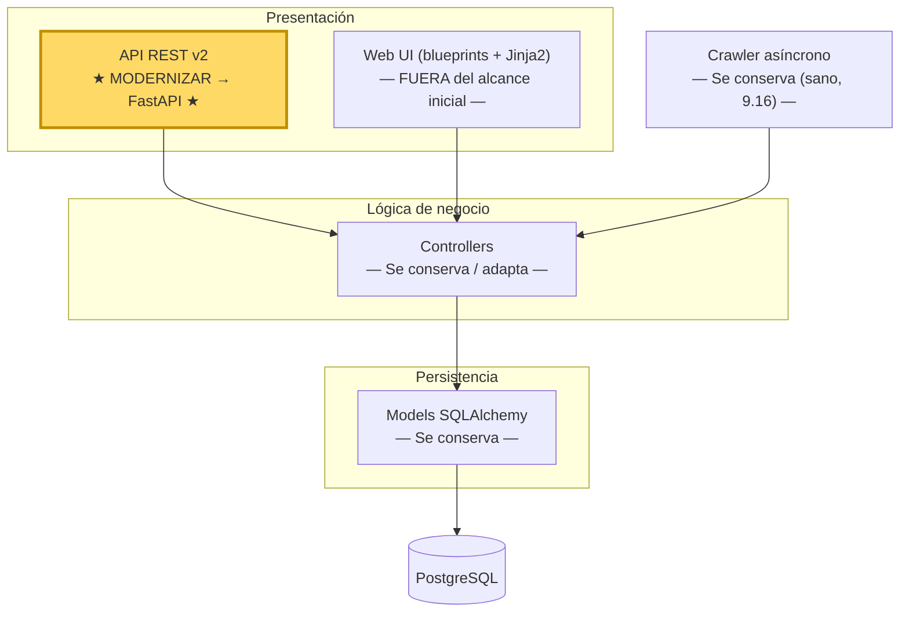
*Figura 2.3. Componentes a modernizar (resaltado): la **API v2** migra a FastAPI; la UI web entra en fases posteriores; Controllers, Models y Crawler se conservan.*

| Componente | ¿Modernizar? | Justificación (con evidencia de cartografía) |
|---|---|---|
| **API v2** (`web/views/api/v2/`) | **Sí — primer incremento** | Contiene `common.py` (**7.71**, peor Code Health del sistema), con **dueño inactivo desde 2016** (máximo riesgo de fuga). Es el punto donde Pydantic/OpenAPI dan mayor retorno y donde la deuda es más aguda. |
| **Web UI** (`web/views/*`, `forms.py`) | **Sí — fases posteriores** | `feed.py` (hotspot problemático, 333 LoC) y `forms.py` (8.78) viven aquí. Se aborda después de la API, una vez validado el patrón Strangler Fig. |
| **Controllers** (`controllers/`) | Conservar / adaptar | Pertenecen al Backend (en declive), pero su lógica de negocio es válida y reutilizable; se adaptan para servir tanto a Flask como a FastAPI durante la transición. |
| **Models** (`models/`) | **No** | Componente `Datos` ejemplar (9.96, tendencia plana). Modernizarlo sería sobreingeniería. |
| **Crawler** (`crawler/`) | **No (por ahora)** | `default_crawler.py` está sano (9.16) pese a ser hotspot. No es prioridad; podría beneficiarse del async nativo a futuro. |

## 2.4 Funcionalidades más importantes a modernizar

| ID | Funcionalidad | Descripción | Criterios de aceptación |
|----|---------------|-------------|--------------------------|
| **F1** | API v2 — Gestión de feeds | Endpoints REST CRUD y operaciones masivas de feeds, migrados a FastAPI con esquemas Pydantic. | (1) Endpoints `GET/POST/PUT/DELETE /feed` y `/feeds` operativos en FastAPI. (2) Validación de entrada/salida vía Pydantic (sustituye el parseo manual de `common.py`). (3) Documentación OpenAPI generada automáticamente. (4) Paridad funcional verificada contra la API Flask v2. |
| **F2** | API v2 — Gestión de artículos | Endpoints REST CRUD y consultas/filtros de artículos en FastAPI. | (1) `GET/POST/PUT/DELETE /article` y `/articles` con filtros y paginación. (2) Filtrado de atributos por rol declarado en esquemas (no en código artesanal). (3) Paridad funcional con la API Flask. |
| **F3** | API v2 — Gestión de categorías | Endpoints REST CRUD de categorías en FastAPI. | (1) `GET/POST/PUT/DELETE /category` y `/categories`. (2) Validación con Pydantic. (3) Paridad funcional. |
| **F4** | Autenticación de la API | Mecanismo de autenticación de la API (hoy HTTP Basic) implementado como dependencia de FastAPI. | (1) Autenticación funcionando como *dependency* reutilizable. (2) Respeto del control de acceso por `user_id` existente. (3) Rechazo correcto de credenciales inválidas (401). |
| **F5** | Convivencia Flask + FastAPI (Strangler Fig) | Enrutamiento que permite que FastAPI atienda los endpoints migrados y Flask el resto, sin interrumpir el servicio. | (1) Las rutas migradas las sirve FastAPI; las no migradas siguen en Flask. (2) Sin downtime durante el corte por endpoint. (3) Misma base de datos y modelos compartidos. |

**Justificación de las funcionalidades incluidas:**

Se priorizó la **API v2** (F1–F4) porque es donde converge toda la evidencia de la cartografía: aloja el archivo de **peor Code Health del sistema** (`common.py`, 7.71), tiene el **dueño inactivo desde 2016** (máximo riesgo de fuga de conocimiento) y es el componente donde FastAPI/Pydantic aportan **el mayor retorno por unidad de esfuerzo** (reemplazar parseo/validación manual por esquemas declarativos + documentación automática). F5 se incluye como funcionalidad habilitante: es la que materializa el patrón **Strangler Fig** y garantiza que la modernización sea incremental y sin interrupciones, alineada con el motivador de negocio (sostener la evolución del producto reduciendo riesgo). La **UI web** y el **crawler** quedan fuera de este alcance inicial por estar, respectivamente, en fases posteriores (F-web) o sanos (crawler).

---

# Uso de IA generativa (IAG)

**¿Se hizo uso de IAG?**
Sí, como herramienta de apoyo para la redacción y estructuración del documento. El trabajo central —selección de la aplicación, ejecución del análisis en CodeScene, definición de los componentes de arquitectura, navegación de las visualizaciones y captura de todas las evidencias— lo realizó el equipo directamente, ya que la IA no tiene acceso al tablero de CodeScene.

**¿Qué herramientas de IAG se usaron?**
Claude (modelo Opus de Anthropic), a través de la interfaz de Claude Code.

**¿En qué partes del entregable se usó la IAG?**
- Estructuración del documento según los puntos exigidos en la guía de la semana 4.
- Derivación de los **diagramas de arquitectura concreta as-is** (componentes, despliegue, modelo de datos) a partir de la inspección directa del código fuente del repositorio de Newspipe.
- Consolidación y redacción de las métricas de mantenibilidad (Code Health, Hotspots, Author Statistics, System Health) reutilizando el análisis previo del reto de CodeScene.
- Redacción de la estrategia de modernización, el alcance y la tabla de funcionalidades, a partir de las decisiones tomadas por el equipo.

**¿Identificó algún sesgo u omisión en los resultados de la IAG?**
Sí, los mismos tres patrones que ya habíamos detectado en la Entrega 1, y que se repitieron aquí:
1. **Tiende a inflar la solución:** proponía secciones y subdivisiones que el enunciado no pedía; el equipo recortó el alcance a lo solicitado.
2. **Sesgo de auto-confirmación al describir la arquitectura WSGI/Flask:** suelta afirmaciones plausibles pero genéricas. Por ejemplo, al describir el despliegue infirió un servidor de producción (Gunicorn); se contrastó contra la documentación del repositorio antes de aceptarlo.
3. **Acepta métricas estimadas:** tiende a dar cifras "a ojo". En la cartografía de CodeScene del reto previo había propuesto patrones de ruta de componentes incorrectos (un solo nivel `newspipe/web/**` en lugar del doble `newspipe/newspipe/...` real), error detectado al ver los componentes con "0 commits"; cada métrica de este entregable se validó contra su evidencia real en CodeScene.

En coherencia con ese criterio, se decidió explícitamente **no** afirmar degradación de desempeño ni de usabilidad por carecer de pruebas de carga y encuestas que lo respalden.

**¿Son confiables y pertinentes los resultados de la IAG?**
Son pertinentes y confiables **siempre que se contrasten con la evidencia**. Cada métrica de mantenibilidad está respaldada por una visualización real de CodeScene verificada por el equipo, y cada afirmación de arquitectura está respaldada por la inspección del código fuente. Donde la IA no tenía datos, su salida no se aceptó sin confirmar.

**¿Los resultados de la IAG se integraron sin modificación o se intervinieron?**
Se intervinieron. El equipo aportó los insumos (análisis de CodeScene, decisiones de estrategia y alcance), validó cada métrica, corrigió las inferencias de la IA y definió el motivador de negocio y el alcance. La IA aceleró la redacción y el ordenamiento; el contenido analítico fue verificado y, en varios puntos, redirigido por el equipo.
